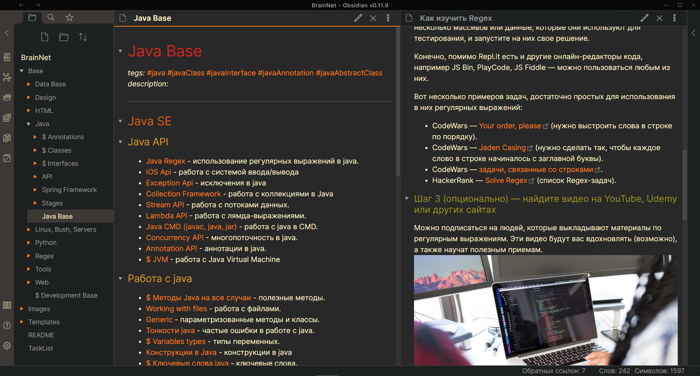
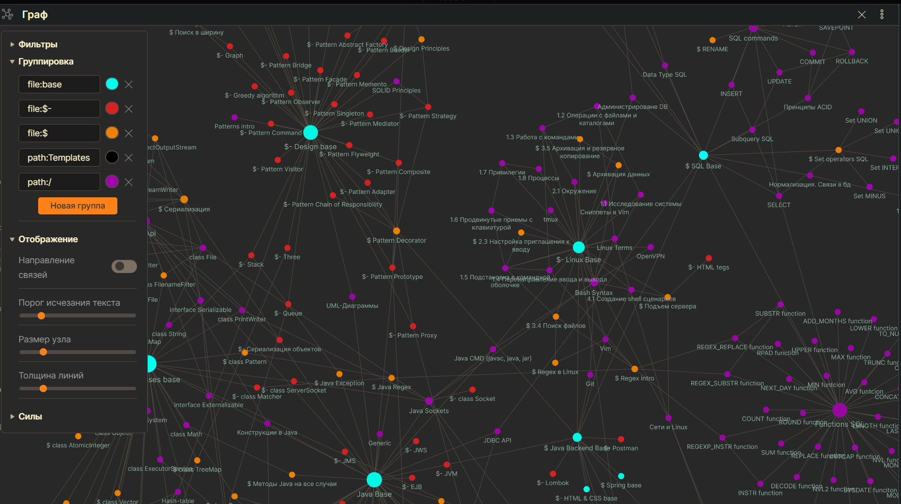

# BrainNet
***BrainNet*** - новая концепция обучения, помогающая равзиватсья программистам любого уровня. BrainNet представляет из себя вечно растущую сеть структурированных и взаимосвязанных знаний по программированию. Чтобы понять, что такое BrainNet, необходимо полностью ознакомиться с этой статьей.

P.S. Проект только начал развиваться, и некоторые вещи еще не реализованы.





### Преимущества BrainNet
- `Графы и их структура`. Граф позволит вам увидеть все знания (узлы) и связи между ними. Вы сразу же сможете понять, насколько та или иная тема является сложной и какие связи у нее есть. Граф имеет раскраску, которая помогает в нем ориентироваться.

- `Универсальные руководства и готовые планы обучения`. BrainNet позволяет с легкостью формировать руководства и планы обучения для любых IT-профессий. Достаточно создать файл с указанием ссылок на необхоидимые для этой профессии знания. Если в сети не будет хватать для этого знаний, любой сможет их добавить. Не стоит недооценивать эту возможность BrainNet, и чтобы ее ощутить, надо установить себе сеть и просмотреть любой имеющийся файл по освоению некой профессии.

- `Уникальная среда`, в которой существует BrainNet. Речь о приложении [Obsidian](https://www.youtube.com/watch?v=thA3xorIb0U). Данная программа имеет целый ряд особенностей:
	- **Скорость работы**. У вас никогда не возникнет лагов, а быстрая работа с ссылками и статьями будет приносить одно удовольствие. В основе сети лежат [Markdown](https://lifehacker.ru/chto-takoe-markdown/) файлы.

	- **[MarkDown](https://lifehacker.ru/chto-takoe-markdown/) файлы**. Все файлы в obsidian являются markdown. Освоить разметку можно за 10 минут, и вы сможете [хорошо организовывать](https://lifehacker.ru/markdown/) заметки и легко придавать им красивый вид. Можно открыть хранилище obsidian в другом текстовом редакторе и с легкостью вносить глобальные изменения, например делать замену строк.
	
	- **Многообразие тем и стилей**. Obsidian может выглядеть как угодно, и если вы не умеете создавать свое оформление, вы можете использовать готовые темы, выбрав `Настройки -> оформление -> просмотр темы сообщества`.
	
	- **Удобная работа со ссылками**. Obsidian можно настроить так, чтобы при наведении на ссылку у вас отображалась мини-версия содержимого этой ссылки. Можно заставить ссылки открываться в новой боковой панели или открыть окно с миниатюрными графами и настроить их глубину.
	
	- **Широкий спектр настроек**. Obsidian - это текстовый редактор с открытым исходным кодом, напоминающий [vs code](https://code.visualstudio.com). В obsidian имеется много настроек, тем и плагинов, но помимо этого вы можете создать собственные. Еще obsidian поддерживает `LaTex`.
		
	- **Наглядные и настраиваемые графы**. Obsidian позволяет отображать все знания в виде взаимосвязанных связей. Про мини-графы уже было сказано. Графы имеют широкие настройки, темы и их можно раскрашивать.

- `Открытая сеть знаний и коллективная разработка`. Именно эта идея обеспечит проекту постоянное развитие. Каждый участник сети сможет внести свои улучшения и развивать эту сеть. GitHub дает отличные инструменты для модерации. Если кто-то встретит непонятные для него узлы, недостающие или незаконченные темы или такие узлы, которые потеряли актуальность, он сможет это быстро исправить. 

- **Идея [второго мозга](https://www.youtube.com/watch?v=cgaktoUoDVQ)**. Да, изначально это не ваш мозг, и от чтения статей вашим он навряд ли станет. Чтобы этот мозг стал частью вас, необходимо следовать советам по полученнию максимальной пользы от BrainNet. До создания практических заданий пока не дошло, но теории уже достаточно. Вскоре появятся планы обучения с последовательными шагами. В настоящий момент в BrainNet содержатся ключевые статьи, содержащие в своем название слово base. `Base` узлы связывают основные знания и формируют простую и понятную структуру. Они имеют ярко-голубой цвет. 

### Как получить максимум пользы?
- Чтобы избежать [синдрома вечного студента](https://disshelp.ru/blog/sindrom-vechnogo-studenta-chto-eto-i-zachem-tak-mnogo-uchitsya/), необходимо фиксировать свой прогресс. Отличный вариант - рисование карты в [XMind](https://www.xmind.net). Например такой:


- Думать над тем, как улучшить каждую статью, какие связи можно в нее добавить и какие упражнения нужно выполнить, чтобы статья усвоилась. <? Если у вас будут на этот счет идеи, обязательно делайте коммиты, и мы их рассмотрим.  Дописать и добавить ссылку на инструкцию по внесению правок ?>

- В BrainNet будут появляться специальные файлы с вопросами и ответмаи на них, подобно тому, как это устроенно в программе [Anki](https://apps.ankiweb.net). Помимо вопросов, будут практические задания. Эти файлы с заданиями лучше всего помогут вам закрепить и освоить любое знание.

## Установка и настройка
1. Для начала вам необходимо скачать [Obsidian](https://obsidian.md/download) и [GitHub Desktop](https://desktop.github.com).
2. После установки GitHub Desktop запускаем эту программу, выбираем File -> Clone a repository -> URL и вводим:
	```bash
	git clone https://github.com/Denis-VR/BrainNet.git
	```
	Теперь у нас должна появиться директория BrainNet.
3. Открываем obsidian, жмем "Открыть папку как хранилище" и выбираем BrainNet.


<?## Как внести свой вклад
## Как внести свой вклад?
Во-первых необходимо внимательно изучить правила для внесения изменнеий в сеть.
### Какие правила нужно соблюдать, чтобы внести изменения?
?>
## От автора
Надеюсь, что данная сеть принесет вам пользу. Пока что она состоит из знаний по освоению профессии разработчика на java, но если добавить немного информации, сеть будет подходить для подготовки администраторов баз данных, full-stack программистов и администраторов сетей. Будет здорово, если к нам присоединятся люди из сферы Big Data, Machine Learning и разработки ПО.