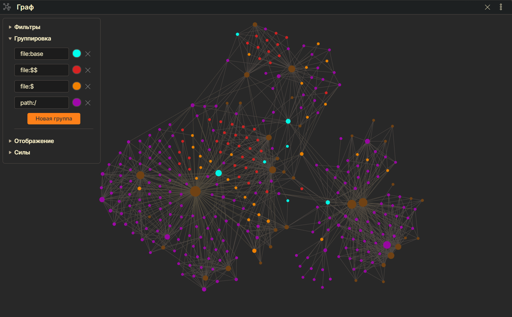

# BrainNet
Репозиторий содержит связанные между собой markdown-файлы с руководством по программированию. Для просмотра и редактирования контента необходимо использовать программу [Obsidian](https://obsidian.md/download).

**Примеры того, как выглядит правильно настроенный проект:**




## Настройка и установка
1. Для начала вам необходимо скачать [Obsidian](https://obsidian.md/download) и [git](https://git-scm.com/downloads).
2. После установки нужно создать на компьютере папку, открыть ее с помощью консоли (Git bash here), и прописать следующую команду:
	```bash
	git clone https://github.com/Denis-VR/BrainNet.git
	```
	После этого у вас должна появиться директория BrainNet.
3. Открываем obsidian, жмем "Открыть папку как хранилище" и выбираем директорию BrainNet
