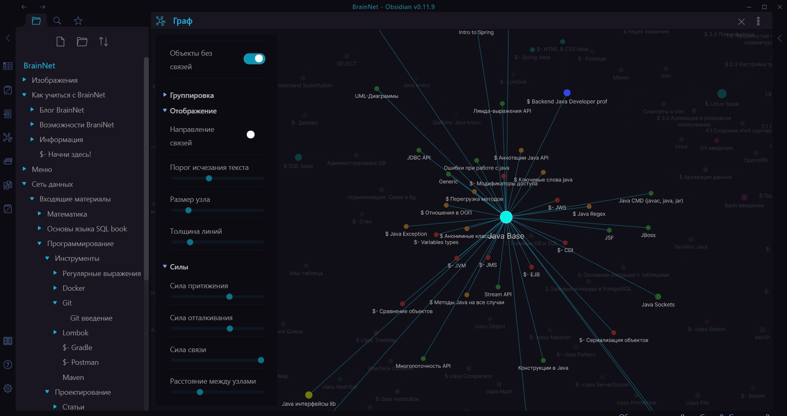
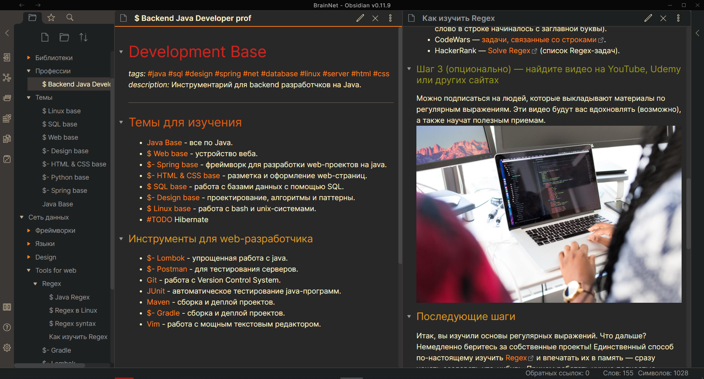

# BrainNet
BrainNet предсталвяет из себя `коллективный`, `вечно развивающийся` и `строго структуированный` мозг, прогоняющий любую входящую инфомрацию через специальные `филтры`. У вас не получиться быстро понять все возможности BrainNet, этому посвящен ряд статей, но вы уже можете [установить](#Parag) сеть и освоить интересующие вас темы или создать проекты.





### Преимущества BrainNet
- **Универсальные руководства, готовые планы обучения и возможность создавать гибкие проекты с нуля**. Чтобы создать план обучения или шаблон создания проекта, достаточно создать файл с указанием ссылок на необходимые для этой профессии или для этого проекта знания. Причем если вы хотите создать бота, то одна инструкция позволит вам создать бота на любой платформе, с использованием любой функциональности и любой базы данных.

- **Наглядные графы**. Граф позволит вам увидеть все знания (узлы) и связи между ними. Вы сразу же сможете понять, насколько та или иная тема или профессия является сложной и какие связи у нее есть. Граф имеет раскраску, которая помогает в нем ориентироваться.

- **Продуманная структура и простой алгоритм внедрения информации**. При создании BrainNet были соблюдены основные принципы проектирования <?добавить ссылку?> и использовались лучшие методы освоения информации мозгом (реальным). Этот пункт выйдет слишком большим, если расписывать структуру BrainNet, для этого написаны отдельные статьи.

- **Простота в использовании**. Возможно вы не сразу поймете устройство BrainNet, но это не мешает с легкостью создавать проекты, осваивать профессии, изучать темы и вносить свои правки по инструкции.

- **Уникальная среда**, в которой существует BrainNet. Речь о приложении [Obsidian](https://www.youtube.com/watch?v=thA3xorIb0U). Данная программа имеет целый ряд особенностей:
	- *Скорость работы*. У вас никогда не возникнет лагов, а быстрая работа со ссылками и статьями будет приносить одно удовольствие. В основе сети лежат *[MarkDown](https://lifehacker.ru/chto-takoe-markdown/) файлы*. Это [предельно простой](https://lifehacker.ru/markdown/) в освоении язык текстовой разметки, позволяющий создавать форматированные документы в обычных текстовых файлах.
	
	- *Многообразие тем и стилей*. Obsidian может выглядеть как угодно, и если вы не умеете создавать свое оформление, вы можете использовать готовые темы, выбрав `Настройки -> оформление -> просмотр темы сообщества`.
	
	- *Широкий спектр настроек*. Obsidian - это текстовый редактор с открытым исходным кодом, напоминающий [vs code](https://code.visualstudio.com). В obsidian имеется много настроек, тем и плагинов, но помимо этого вы можете создать собственные. Еще obsidian поддерживает `LaTex`.
		
	- *Наглядные и настраиваемые графы*. Obsidian позволяет отображать все знания в виде взаимосвязанных связей. Помиомо основного графа можно открывать мини-графы, позволяющие путешествовать по знанияем. Графы имеют широкие настройки, темы и их можно раскрашивать. Это и другие инструменты obsidian делают процесс поиска информации максимально простым.

- **Открытая сеть знаний и коллективная разработка**. Именно эта идея обеспечит проекту постоянное развитие. Каждый привлеченный участник сети сможет внести свои улучшения и развивать эту сеть, поэтому стоит расскзать об этом своим друзьям, если конечно вы уверены, что этот проект поможет им. GitHub дает отличные инструменты для модерации. Если кто-то встретит непонятные для него узлы, недостающие или незаконченные темы или такие узлы, которые потеряли актуальность, он сможет это быстро исправить. 

- **Идея [второго мозга](https://www.youtube.com/watch?v=cgaktoUoDVQ)**. Да, изначально это не ваш мозг, и от чтения статей вашим он навряд ли станет. Чтобы этот мозг стал частью вас, необходимо следовать советам по получению максимальной пользы от BrainNet. До создания практических заданий пока не дошло, но теории уже достаточно. Вскоре появятся планы обучения с последовательными шагами. В настоящий момент в BrainNet содержатся ключевые статьи, содержащие в своем название слово base. `Base` узлы связывают основные знания и формируют простую и понятную структуру. Они имеют ярко-голубой цвет. 

- **Супер мозг в вашем кармане!** Каждый узел BrainNet в худшем случае может занимать 10 кб, основной размер занимают изображения. На 02.04.2021 написано около 300 статей и сеть данных занимает всего 0.5 мб. Узлы не могут занимать больше 10 кб, иначе они слишком объемные и их можно разделить на несколько мелкий статей.

### Как получить максимум пользы?
- Чтобы избежать [синдрома вечного студента](https://disshelp.ru/blog/sindrom-vechnogo-studenta-chto-eto-i-zachem-tak-mnogo-uchitsya/), необходимо фиксировать свой прогресс. Отличный вариант - рисование карты в [XMind](https://www.xmind.net). Например такой:


- Думать над тем, как улучшить каждую статью, какие связи можно в нее добавить и какие упражнения нужно выполнить, чтобы статья усвоилась. Чем больше вы напрягает свой мозг, тем лучше усваиваете информацию.

- В BrainNet будут появляться специальные файлы с вопросами и ответами на них, подобно тому, как это устроенно в программе [Anki](https://apps.ankiweb.net). Также будут появляться практические задания и файлы с проектами, где будут указаны минимальные знания для реализации этого проекта и инструкции по созданию проекта.

- Посвящать BrainNet как можно больше времени и создавать сложные проекты, вникая во все детали создания этих проектов.

## <a name="Parag"></a> Установка
1. Для начала вам необходимо скачать [Obsidian](https://obsidian.md/download) и [GitHub Desktop](https://desktop.github.com).
2. После установки GitHub Desktop запускаем эту программу, выбираем File -> Clone a repository -> URL и вводим:
	```bash
	https://github.com/Denis-VR/BrainNet.git
	```
	Теперь у вас должна появиться директория BrainNet.
3. Открываем obsidian, жмем "Открыть папку как хранилище" и выбираем BrainNet.


<?## Как внести свой вклад
## Как внести свой вклад?
Во-первых необходимо внимательно изучить правила для внесения изменнеий в сеть.
### Какие правила нужно соблюдать, чтобы внести изменения?
?>
