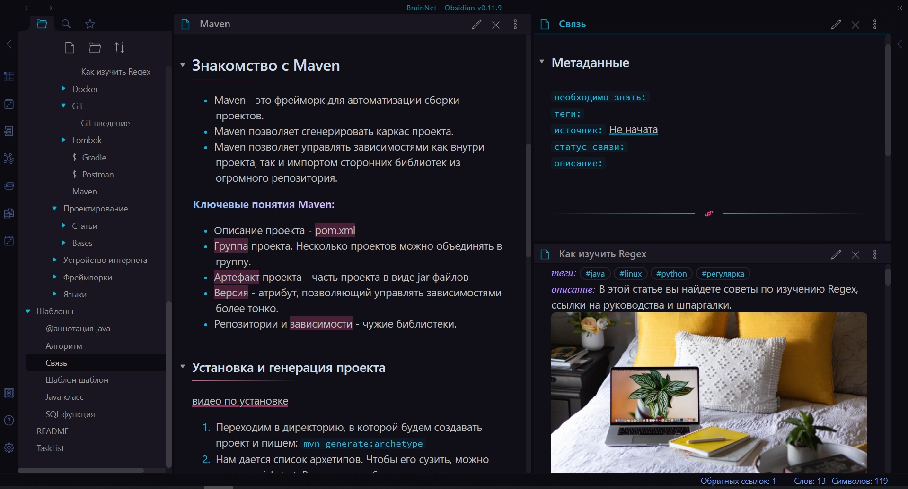

# BrainNet
***BrainNet*** - новая концепция обучения, помогающая развиваться программистам любого уровня. BrainNet представляет из себя вечно растущую сеть структурированных и взаимосвязанных знаний по программированию.  <?Можете сразу перейти к [установке](#install) и увдитеть как устроен BrainNet.?>




### Преимущества BrainNet
- **Графы и их структура**. Граф позволит вам увидеть все знания (узлы) и связи между ними. Вы сразу же сможете понять, насколько та или иная тема или профессия является сложной и какие связи у нее есть. Граф имеет раскраску, которая помогает в нем ориентироваться.

- **Универсальные руководства и готовые планы обучения**. BrainNet позволяет с легкостью создавать проекты и планы обучения для любых IT-профессий. Достаточно создать файл с указанием ссылок на необходимые для этой профессии или для этого проекта знания. Каждый новый участник запросто может внести свой вклад и создать новые узлы. Не стоит недооценивать эту возможность BrainNet, и чтобы ее ощутить, надо установить себе сеть и просмотреть любой имеющийся файл по освоению некой профессии.

- **Уникальная среда**, в которой существует BrainNet. Речь о приложении [Obsidian](https://www.youtube.com/watch?v=thA3xorIb0U). Данная программа имеет целый ряд особенностей:
	- *Скорость работы*. У вас никогда не возникнет лагов, а быстрая работа со ссылками и статьями будет приносить одно удовольствие. В основе сети лежат *[MarkDown](https://lifehacker.ru/chto-takoe-markdown/) файлы*. Освоить разметку можно за 10 минут, и вы сможете [организовывать](https://lifehacker.ru/markdown/) и красиво офорлять любые заметки.
	
	- *Многообразие тем и стилей*. Obsidian может выглядеть как угодно, и если вы не умеете создавать свое оформление, вы можете использовать готовые темы, выбрав `Настройки -> оформление -> просмотр темы сообщества`.
	
	- *Широкий спектр настроек*. Obsidian - это текстовый редактор с открытым исходным кодом, напоминающий [vs code](https://code.visualstudio.com). В obsidian имеется много настроек, тем и плагинов, но помимо этого вы можете создать собственные. Еще obsidian поддерживает `LaTex`.
		
	- *Наглядные и настраиваемые графы*. Obsidian позволяет отображать все знания в виде взаимосвязанных связей. Помиомо основного графа можно открывать мини-графы, позволяющие путешествовать по знанияем. Графы имеют широкие настройки, темы и их можно раскрашивать. Это и другие инструменты obsidian делают процесс поиска информации максимально простым.

- **Открытая сеть знаний и коллективная разработка**. Именно эта идея обеспечит проекту постоянное развитие. Каждый привлеченный участник сети сможет внести свои улучшения и развивать эту сеть, поэтому стоит расскзать об этом своим друзьям, если конечно вы уверены, что этот проект поможет им. GitHub дает отличные инструменты для модерации. Если кто-то встретит непонятные для него узлы, недостающие или незаконченные темы или такие узлы, которые потеряли актуальность, он сможет это быстро исправить. 

- **Идея [второго мозга](https://www.youtube.com/watch?v=cgaktoUoDVQ)**. Да, изначально это не ваш мозг, и от чтения статей вашим он навряд ли станет. Чтобы этот мозг стал частью вас, необходимо следовать советам по получению максимальной пользы от BrainNet. До создания практических заданий пока не дошло, но теории уже достаточно. Вскоре появятся планы обучения с последовательными шагами. В настоящий момент в BrainNet содержатся ключевые статьи, содержащие в своем название слово base. `Base` узлы связывают основные знания и формируют простую и понятную структуру. Они имеют ярко-голубой цвет. 

### Как получить максимум пользы?
- Чтобы избежать [синдрома вечного студента](https://disshelp.ru/blog/sindrom-vechnogo-studenta-chto-eto-i-zachem-tak-mnogo-uchitsya/), необходимо фиксировать свой прогресс. Отличный вариант - рисование карты в [XMind](https://www.xmind.net). Например такой:


- Думать над тем, как улучшить каждую статью, какие связи можно в нее добавить и какие упражнения нужно выполнить, чтобы статья усвоилась. Чем больше вы напрягает свой мозг, тем лучше усваиваете информацию.

- В BrainNet будут появляться специальные файлы с вопросами и ответами на них, подобно тому, как это устроенно в программе [Anki](https://apps.ankiweb.net). Также будут появляться практические задания и файлы с проектами, где будут указаны минимальные знания для реализации этого проекта и инструкции по созданию проекта.

## <a name="install"></a> Установка
1. Для начала нам необходимо скачать [Obsidian](https://obsidian.md/download) и [GitHub Desktop](https://desktop.github.com).
2. После установки GitHub Desktop запускаем эту программу, выбираем File -> Clone a repository -> URL и вводим:
	```bash
	https://github.com/Denis-VR/BrainNet.git
	```
	Теперь у нас должна появиться директория BrainNet.
3. Открываем obsidian, жмем "Открыть папку как хранилище" и выбираем BrainNet.


<?## Как внести свой вклад
## Как внести свой вклад?
Во-первых необходимо внимательно изучить правила для внесения изменнеий в сеть.
### Какие правила нужно соблюдать, чтобы внести изменения?
?>
